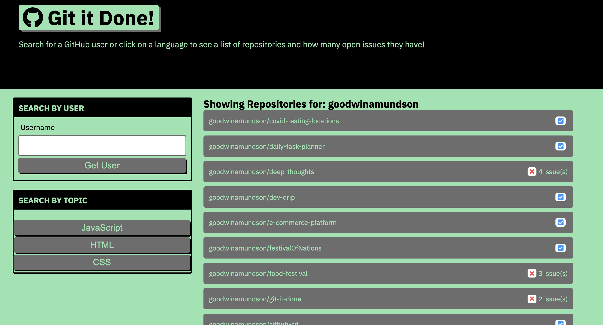

<h1 align="center">Github Repo Finder<h1>

## Description 
This project is a web application that uses GitHub's API to search for open source projects with open issues and pull requests. This applications uses the browser's Fetch API to communicate with the server. 

## Table of Contents
* [Installation](#installation)
* [Usage](#usage)
* [License](#license)
* [Contributing](#contributing)
* [Tests](#tests)
* [Questions](#questions)

## Installation 
Users should clone the repository from GitHub and open the index file in the browser.

## Usage 
This application allows users to search for any user on GitHub and view their open source projects. 
Please view deployed on [GitHub Pages](https://goodwinamundson.github.io/git-it-done/)
 

## License 
This project is licensed under MIT

## Contributing 
Contributors should read the installation section. 

## Tests
There are no tests for this application. 

## Questions
If you have any questions about this projects, please contact me directly at goodwinamundson@gmail.com. You can view more of my projects at https://github.com/goodwinamundson.